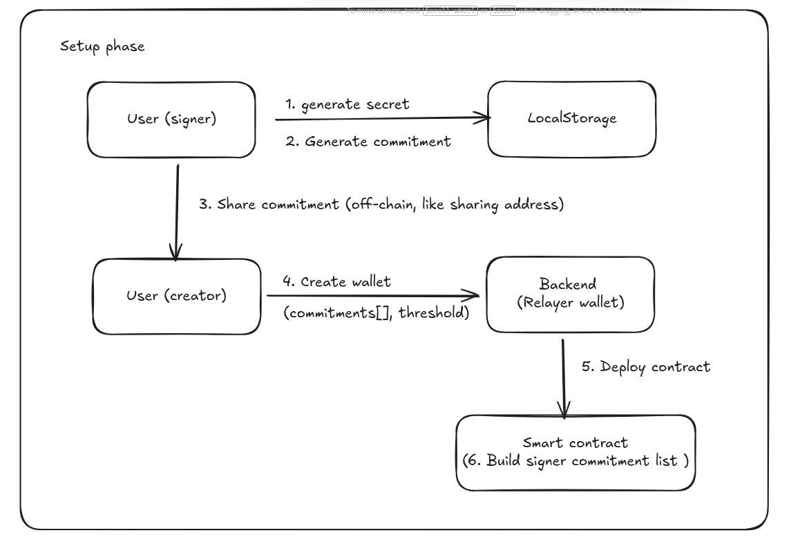
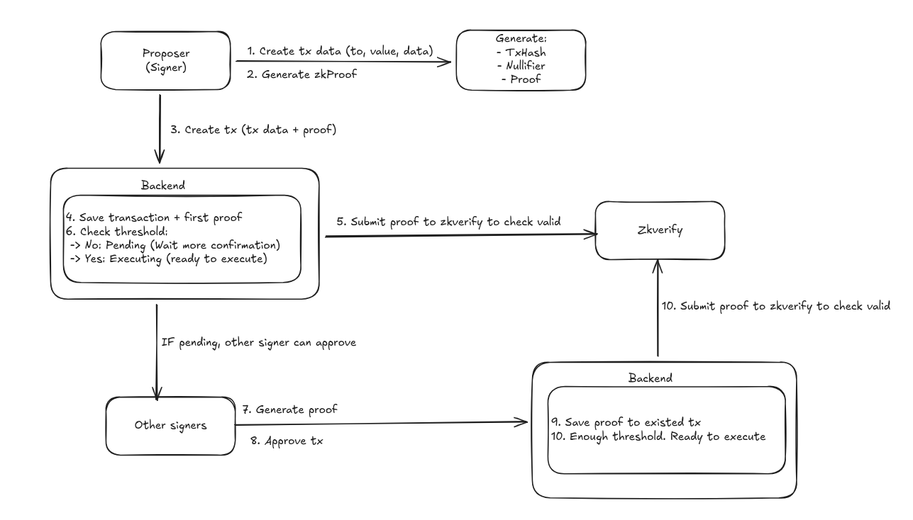
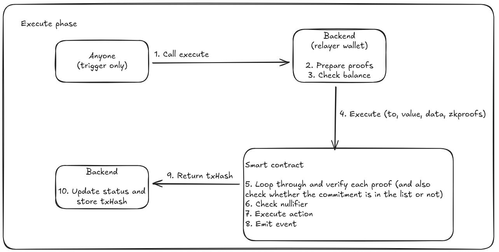

# Architecture

### Transaction Lifecycle

#### Phase 1: Setup (One-time)

<figure><figcaption></figcaption></figure>

#### Phase 2: Propose & Sign

<figure><figcaption></figcaption></figure>

#### Phase 3: Execute

<figure><figcaption></figcaption></figure>
