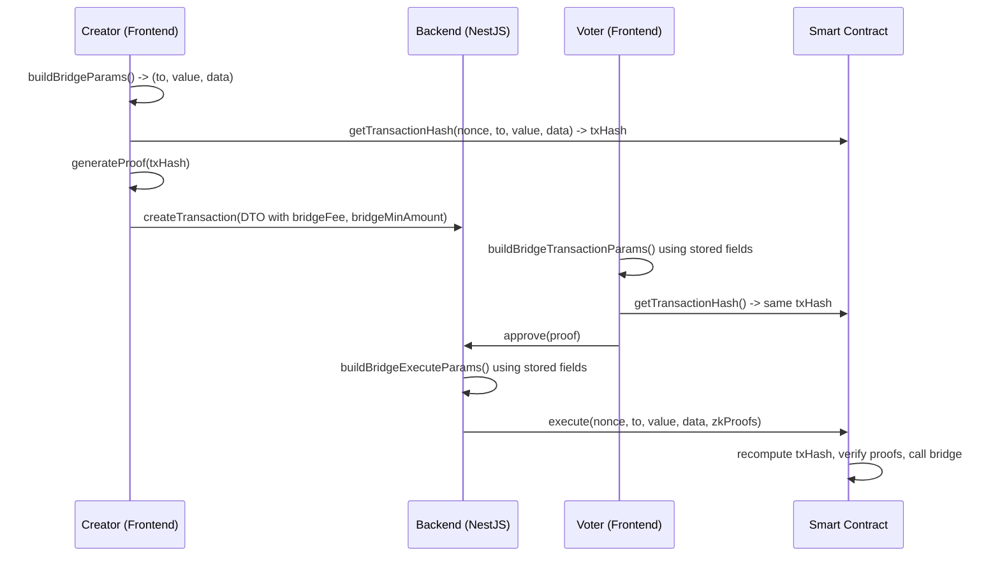

# Cross-Chain Bridge Implementation

Technical reference for cross-chain transfers in PolyPay.

## Architecture Overview

Cross-chain transfers reuse `TxType.TRANSFER` with extra metadata (`destChainId`, `bridgeFee`, `bridgeMinAmount`). Three actors must produce **byte-identical calldata** so that ZK proofs match the on-chain txHash.

## Bridge Routes

| Token | Direction | Mechanism | OFT Contract | Notes |
|-------|-----------|-----------|-------------|-------|
| ETH | Base -> Horizen | OP Stack native bridge | N/A | Reverse excluded (7-day fraud proof) |
| ZEN | Base <-> Horizen | LayerZero | Adapter on Base, OFT on Horizen | Bidirectional, testnet supported |
| USDC | Base <-> Horizen | Stargate V2 (LayerZero) | Adapter on both chains | Mainnet only, ~0.06% protocol fee |

Route availability is determined by `getAvailableDestChains()` in `bridge.ts`. Cross-chain requires contract version >= 2 (`isCrossChainEnabled()`).

## Encoding Logic

The OFT contract entry `type` determines how the multisig calls the bridge:

| OFT Type | execute() params | When used |
|----------|-----------------|-----------|
| `"oft"` | `to = OFT address`, `value = bridgeFee`, `data = encodeLzSend(...)` | Token IS the OFT (e.g., ZEN on Horizen) |
| `"adapter"` | `to = wallet (self-call)`, `value = 0`, `data = encodeApproveAndCall(...)` | Token separate from OFT, needs allowance first |

For adapters, `approveAndCall` (added in MetaMultiSigWallet v2, `onlySelf` modifier) atomically approves the token and calls `OFT.send()`. The `callValue` parameter forwards ETH from the wallet's own balance to pay the LayerZero fee.

For Stargate OFTs (`stargate: true` in config), `oftCmd` is set to `"0x01"` (taxi mode) for immediate delivery. Standard OFTs use empty `oftCmd`.

## Fees and Slippage

| Field | What it is | Source | Paid in | Stored in DB |
|-------|-----------|--------|---------|--------------|
| `bridgeFee` | LayerZero messaging fee | `quoteSend()` (one-time, by creator) | ETH from wallet balance | Yes |
| `bridgeMinAmount` | Min tokens recipient must receive | `removeDust()` (standard OFT) or `quoteOFT().amountReceivedLD` (Stargate) | N/A (threshold) | Yes |
| Stargate protocol fee | ~0.06% deducted from transfer amount | Implicit in `quoteOFT()` result | USDC (deducted from amount) | No (embedded in `bridgeMinAmount`) |

Standard OFTs (ZEN) are 1:1 transfers with no price impact. `removeDust()` strips precision bits lost during LayerZero's shared-decimals (6) conversion -- only relevant when local decimals > 6 (e.g., 18 for ZEN).

Stargate OFTs (USDC) charge a protocol fee, so `minAmountLD` must come from `quoteOFT()` rather than `removeDust()` to avoid `Stargate_SlippageTooHigh` reverts.

## txHash Consistency

All three actors (creator, voter, backend) must encode identical `(to, value, data)` so the smart contract's recomputed txHash matches the ZK proofs. Non-deterministic values are stored in DB and reused:

| Field | Why stored | Fallback if null |
|-------|-----------|-----------------|
| `bridgeFee` | LZ fee changes over time | `0` |
| `bridgeMinAmount` | Stargate fee is non-deterministic | `removeDust(amount, decimals)` |

Deterministic values (`dstEid`, `oftCmd`) are derived at runtime from config.

## Database Fields

| Column | Type | Description |
|--------|------|-------------|
| `destChainId` | `Int?` | Destination chain ID. Null = same-chain. |
| `bridgeFee` | `String?` | LZ native fee in wei. |
| `bridgeMinAmount` | `String?` | Min received amount in token's smallest unit. |

## External References

- [LayerZero V2 OFT Documentation](https://docs.layerzero.network/v2/developers/evm/oft/quickstart)
- [Stargate V2 Developer Docs](https://stargateprotocol.gitbook.io/stargate/v2-developer-docs)
- [OP Stack Standard Bridge](https://docs.optimism.io/app-developers/bridging/standard-bridge)
- [Horizen Documentation](https://docs.horizen.io)
