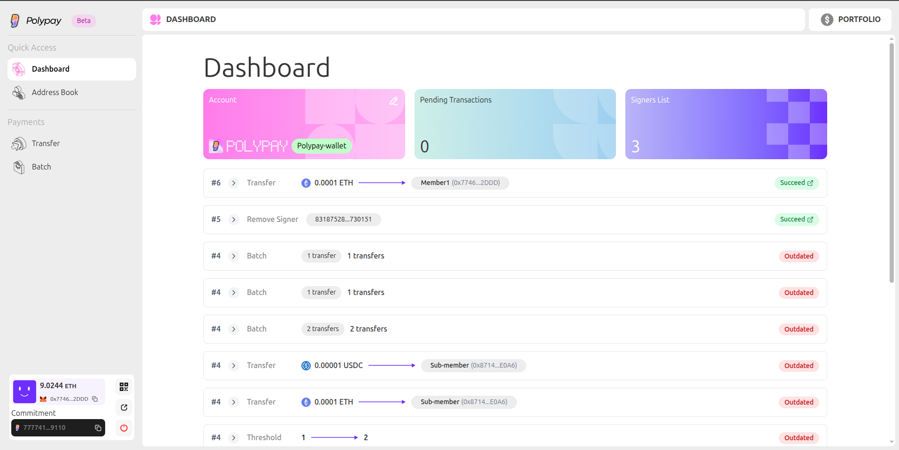
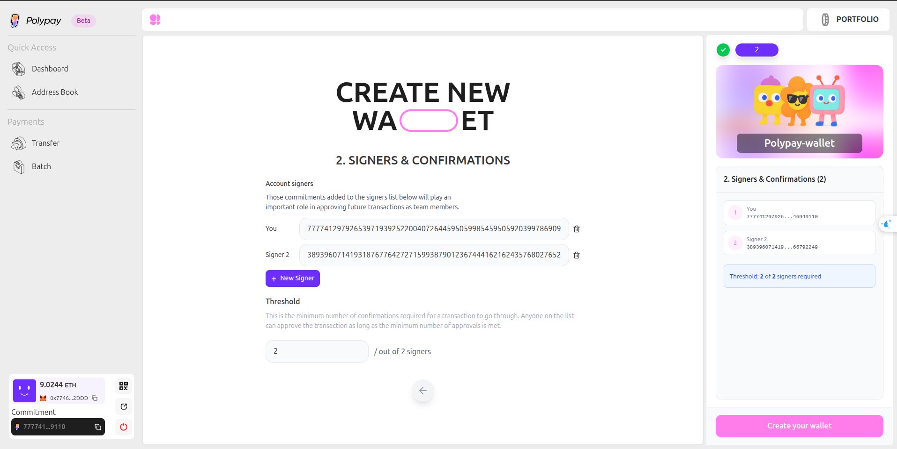
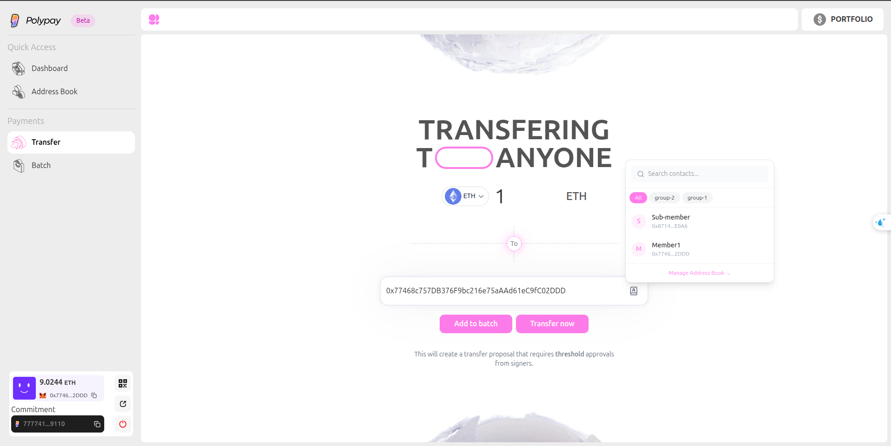

# How to use Polypay App

## Polypay App (Beta v0.1)

Polypay app beta v0.1 is an initial release of the Polypay platform. It is a web application that allows you to create and manage a multisig account on **Horizen mainnet** with a focus on privacy. Current version includes the following features:

- Create and manage a multisig account
- Hide signers(multisig account owners) identities with ZK proofs
- Execute payroll payments: Transfer funds to multiple recipients
- View transaction history
- View multisig account balance
- View multisig account address

### User Workflow

1. **Connect Wallet**: Connect your wallet
2. **Generate Identity**: Sign a message to create your secret
3. **Create/Join Account**: Deploy new multisig or join existing one
4. **Propose Transaction**: Create transfer and generate ZK proof
5. **Sign**: Other signers approve with their ZK proofs
6. **Execute**: When threshold reached, execute the transaction

### Video Demo

[Watch on X (Twitter)](https://x.com/poly_pay/status/2013907209982267721)

### Screenshots

#### Dashboard

Overview of your multisig account including balance, pending transactions, and signers list.

#### Create New Account

Create a new multisig account by adding signer commitments and setting the threshold.

#### Transfer

Send funds to single or multiple recipients with ZK proof generation.

