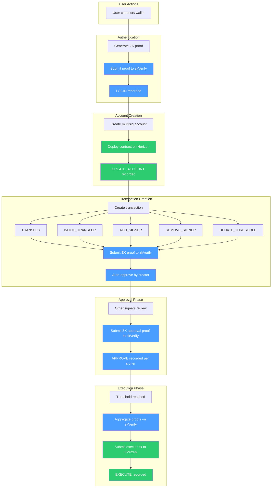
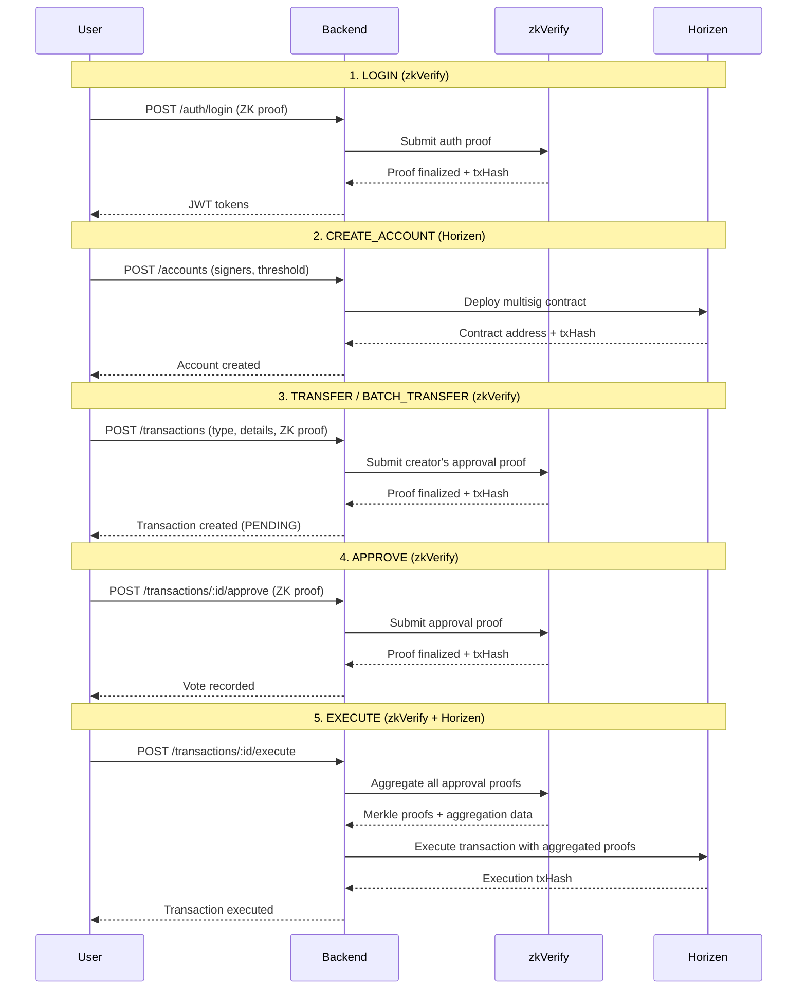

# PolyPay Transaction Flow

## Blockchain Classification

| Action | Blockchain | Description |
|--------|-----------|-------------|
| LOGIN | zkVerify | ZK auth proof verified on zkVerify |
| CREATE_ACCOUNT | Horizen | Multisig contract deployed on Horizen |
| APPROVE | zkVerify | ZK approval proof submitted to zkVerify |
| TRANSFER | zkVerify | ZK proof for transfer vote (initial approval) |
| BATCH_TRANSFER | zkVerify | ZK proof for batch transfer vote (initial approval) |
| ADD_SIGNER | zkVerify | ZK proof for add signer vote (initial approval) |
| REMOVE_SIGNER | zkVerify | ZK proof for remove signer vote (initial approval) |
| UPDATE_THRESHOLD | zkVerify | ZK proof for threshold update vote (initial approval) |
| EXECUTE | Horizen | Final on-chain execution on Horizen (after proof aggregation from zkVerify) |

## Flow Diagram

**Legend:** Blue = zkVerify | Green = Horizen

## Detailed Transaction Lifecycle

## Summary

PolyPay uses a **dual-blockchain architecture**:

- **zkVerify**: Handles all ZK proof verification and aggregation. Every user action (login, approve, create transaction) requires a ZK proof that gets verified on zkVerify. This ensures privacy-preserving authentication and authorization.

- **Horizen**: Handles all on-chain state changes. Contract deployments (CREATE_ACCOUNT) and transaction executions (EXECUTE) happen on Horizen. The execute call includes aggregated proof data from zkVerify as parameters to the smart contract.

### The key insight:
- **Creating/voting** on a transaction = zkVerify (proof verification)
- **Executing** a transaction = Horizen (state change), after aggregating proofs from zkVerify
- A single user action like EXECUTE actually touches **both** blockchains (aggregate on zkVerify, then execute on Horizen)
