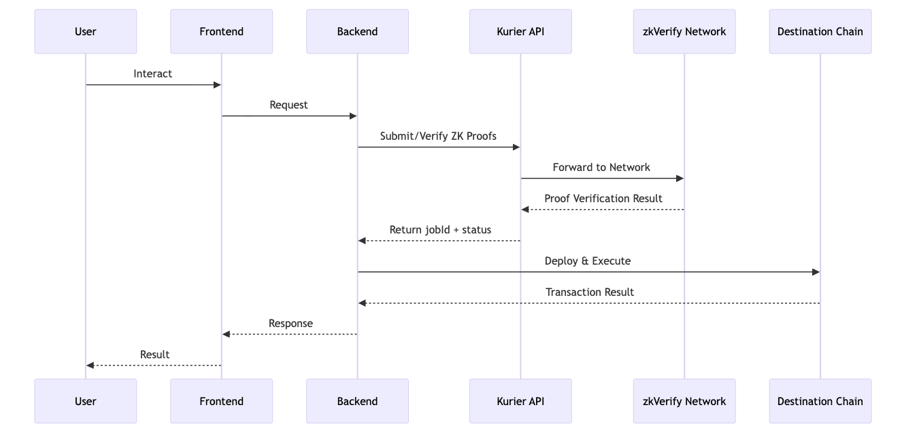
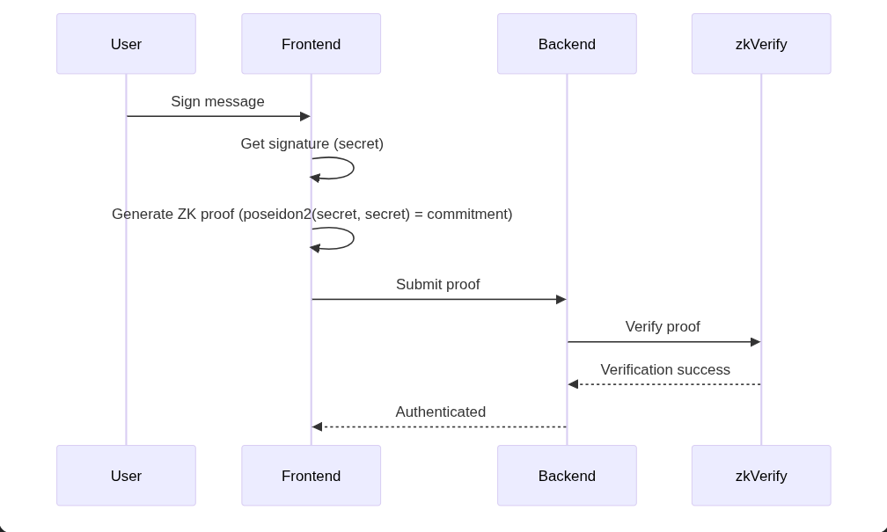
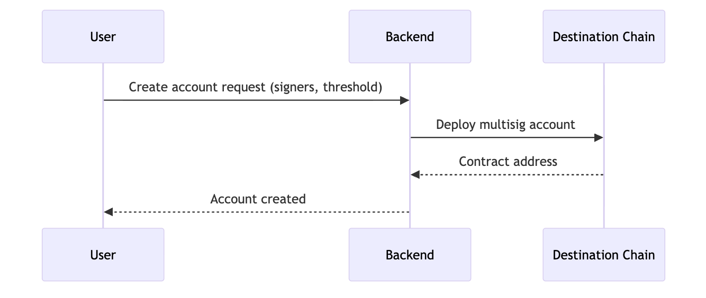
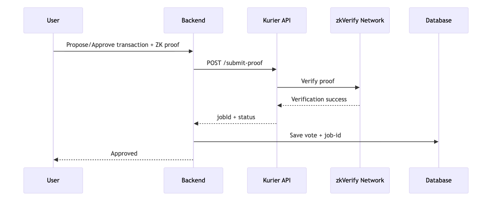
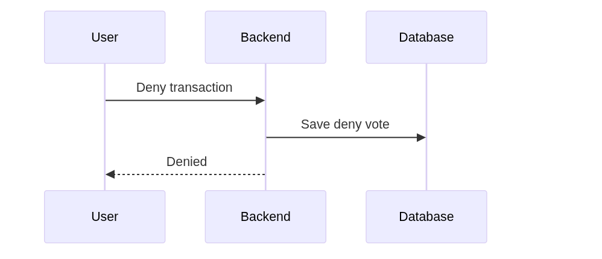
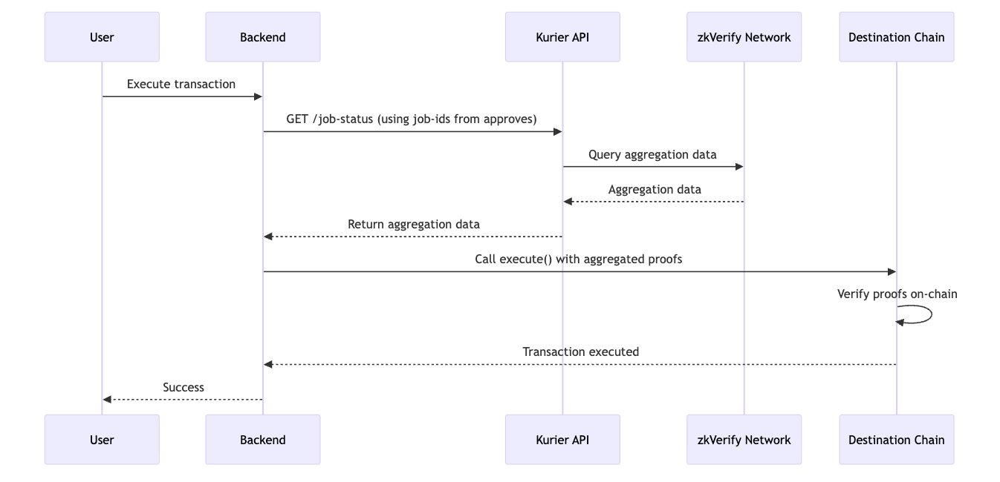

# zkVerify & Horizen Integration

## Overview

PolyPay uses two blockchain layers for privacy-preserving multisig operations:

- **zkVerify**: Verifies zero-knowledge proofs (ultraplonk) off-chain, providing proof verification and aggregation as a service
- **Horizen**: EVM-compatible L3 blockchain where multisig accounts (`MetaMultiSigWallet` contracts) are deployed and transactions are executed

## Blockchain Classification

| Action | Blockchain | Description |
|--------|-----------|-------------|
| LOGIN | zkVerify | ZK auth proof verified on zkVerify |
| CREATE_ACCOUNT | Horizen | `MetaMultiSigWallet` contract deployed on Horizen |
| PROPOSE (create tx) | zkVerify | Creator's approval proof submitted to zkVerify |
| APPROVE | zkVerify | Signer's approval proof submitted to zkVerify |
| DENY | None | Off-chain vote, no proof or on-chain interaction |
| EXECUTE | zkVerify + Horizen | Proofs aggregated on zkVerify, then executed on Horizen |

## Architecture



## Flows

### 1. Authentication (LOGIN)

User proves ownership of their commitment without revealing the secret.



**API:** `POST /api/auth/login`

1. User submits a ZK proof (ultraplonk) with their commitment and public inputs
2. Backend submits proof to zkVerify via the Kurier API (`submit-proof`)
3. Backend polls until proof status reaches `IncludedInBlock` (finalized)
4. On success, user record is created (if new) and JWT tokens are issued

- **zkVerify**: Verify ultraplonk proof, return `jobId` and `zkVerifyTxHash`
- **Horizen**: No interaction

### 2. Account Creation (CREATE_ACCOUNT)

Deploy a new multisig account on Horizen.



**API:** `POST /api/accounts`

1. User provides account name, threshold (M-of-N), and list of signers (commitments)
2. Backend validates the creator is included as a signer
3. Relayer deploys `MetaMultiSigWallet` contract on Horizen with:
   - zkVerify contract address (for on-chain proof verification)
   - Verification key hash
   - Initial signer commitments and threshold
4. Contract address is stored and all signers are notified via WebSocket

- **zkVerify**: No interaction
- **Horizen**: Deploy `MetaMultiSigWallet` contract

### 3. Transaction Lifecycle

#### Propose & Approve

When a user proposes a transaction, they automatically approve it. Other signers can then approve.



**Propose API:** `POST /api/transactions`
**Approve API:** `POST /api/transactions/{txId}/approve`

1. User submits a ZK proof along with a unique nullifier (prevents replay attacks)
2. Backend submits proof to zkVerify, waits for `IncludedInBlock`
3. A `Vote` record is created with `voteType: APPROVE` and the `jobId` from zkVerify
4. Vote proof status starts as `PENDING` (later aggregated during execution)

- **zkVerify**: Verify proof, return `jobId`
- **Horizen**: No interaction

#### Deny

Deny is simply a "disagree" vote — no proof required, no on-chain interaction.



**API:** `POST /api/transactions/{txId}/deny`

1. User submits a deny vote (no proof data needed)
2. Backend checks if the transaction can still reach threshold
3. If `currentApproves + remainingVoters < threshold`, the transaction is marked `FAILED`

- **zkVerify**: No interaction (no proof needed)
- **Horizen**: No interaction (no gas cost)

#### Execute

When threshold is met, execute the transaction on Horizen using aggregated proofs.



**API:** `POST /api/transactions/{txId}/execute`

1. **Proof Aggregation (zkVerify):**
   - For each `APPROVE` vote, poll zkVerify for aggregation status via `job-status` endpoint
   - Wait until each proof reaches `Aggregated` state (polls up to 30 times, 10s intervals)
   - Collect `aggregationId`, `merkleProof`, `leafIndex`, and `leafCount` per vote

2. **On-chain Execution (Horizen):**
   - Build `ZKProof[]` array containing each signer's aggregated proof data:
     ```
     { commitment, nullifier, aggregationId, domainId, zkMerklePath, leafCount, index }
     ```
   - Call `MetaMultiSigWallet.execute(nonce, to, value, data, zkProofs)` on Horizen
   - The smart contract verifies each aggregated proof via the zkVerify oracle on-chain
   - Transaction is marked `EXECUTED` with the Horizen `txHash`

3. **Post-execution side effects:**
   - ADD_SIGNER: New signers are added to the account
   - REMOVE_SIGNER: Signers are removed and their pending votes are deleted
   - UPDATE_THRESHOLD: Threshold is updated on all pending transactions

- **zkVerify**: Provide aggregation data (merkle proofs) from job-ids
- **Horizen**: Verify aggregated proofs via zkVerify oracle + execute transaction

### 4. Transaction Types

All transaction types follow the same Propose → Approve → Execute flow:

| Type             | Description                            |
| ---------------- | -------------------------------------- |
| TRANSFER         | Transfer ETH or ERC20 tokens to a recipient |
| BATCH_TRANSFER   | Transfer tokens to multiple recipients in one execution |
| ADD_SIGNER       | Add new signer(s) to the multisig |
| REMOVE_SIGNER    | Remove signer(s) from the multisig |
| UPDATE_THRESHOLD | Change the M-of-N approval threshold |

## Proof Lifecycle

Each ZK proof goes through the following states on zkVerify:

```
PENDING → IncludedInBlock → AggregationPending → Aggregated
                                                      ↓
                                              Ready for execute()
```

| State | Description |
|-------|-------------|
| `PENDING` | Proof submitted, waiting for on-chain inclusion |
| `IncludedInBlock` | Proof verified and finalized on zkVerify |
| `AggregationPending` | Proof is being aggregated with others |
| `Aggregated` | Aggregation complete, merkle proof available for Horizen execution |
| `Failed` | Proof verification failed |

## Explorer Links

### zkVerify

- **Mainnet**: https://zkverify.subscan.io/
- **Testnet**: https://zkverify-testnet.subscan.io/

### Horizen

- **Mainnet**: https://horizen.calderaexplorer.xyz/
- **Testnet**: https://horizen-testnet.explorer.caldera.xyz/
